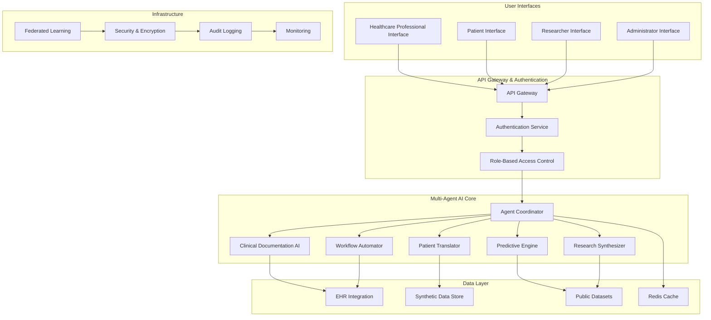
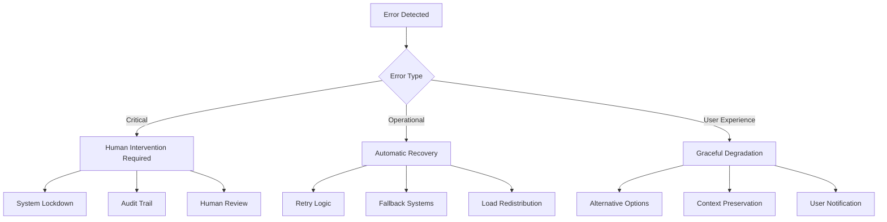

# Design Document: CARENET AI Healthcare Assistant

## Overview

CARENET AI is a unified intelligent healthcare assistant that implements a multi-agent AI ecosystem to address critical inefficiencies in healthcare systems. The solution provides an integrated intelligence layer connecting patients, doctors, researchers, and healthcare systems through five specialized AI modules working in coordination.

The system addresses four root problems in healthcare: information fragmentation, administrative overload, poor patient understanding, and reactive healthcare approaches. By implementing a preventive-focused, AI-driven approach, CARENET AI aims to reduce documentation time by 50%, improve patient understanding and treatment adherence, and enable predictive healthcare interventions.

## Architecture

### System Architecture Overview



### Multi-Agent Coordination Architecture

The system implements a hierarchical multi-agent architecture where:

1. **Agent Coordinator** serves as the central orchestrator
2. **Specialized Agents** handle domain-specific tasks
3. **Conflict Resolution** mechanisms ensure consistent outputs
4. **Load Balancing** optimizes performance across agents
5. **Human Oversight** maintains control over critical decisions

## Components and Interfaces

### 1. Clinical Documentation AI Module

**Purpose**: Convert doctor-patient conversations into structured clinical documentation

**Core Components**:
- **Speech Recognition Engine**: Medical-specialized ASR with 95%+ accuracy for medical terminology
- **Medical NLP Processor**: Extracts medical entities (symptoms, diagnoses, medications, procedures)
- **Clinical Note Generator**: Formats structured documentation according to medical standards
- **Verification Interface**: Requires healthcare professional approval before finalization

**Technology Stack**:
- Medical-trained speech-to-text models (based on research showing $1.73B market in 2024)
- Transformer-based medical NLP for entity recognition
- Template-based clinical note generation
- HIPAA-compliant audio processing

**Interfaces**:
```typescript
interface ClinicalDocumentationService {
  processAudioConversation(audioData: AudioStream, sessionId: string): Promise<ClinicalNote>
  extractMedicalEntities(transcript: string): Promise<MedicalEntity[]>
  generateStructuredNote(entities: MedicalEntity[], template: NoteTemplate): Promise<ClinicalNote>
  requireVerification(note: ClinicalNote, providerId: string): Promise<VerificationStatus>
}
```

### 2. Patient Translator Module

**Purpose**: Convert complex medical terminology into patient-friendly explanations

**Core Components**:
- **Medical Terminology Processor**: Identifies complex medical terms
- **Plain Language Generator**: Creates simple, accurate explanations
- **Risk Communication Engine**: Explains health risks and preventive measures
- **Interactive Q&A System**: Handles patient clarification requests

**Technology Stack**:
- Medical terminology databases and ontologies
- Natural language generation models trained on patient education materials
- Risk communication frameworks based on health literacy research
- Conversational AI for interactive support

**Interfaces**:
```typescript
interface PatientTranslatorService {
  translateMedicalReport(report: MedicalReport): Promise<PatientFriendlyReport>
  generateMedicationInstructions(prescription: Prescription): Promise<PatientInstructions>
  explainRisksAndRecommendations(condition: MedicalCondition): Promise<RiskExplanation>
  handlePatientQuestions(question: string, context: MedicalContext): Promise<Answer>
}
```

### 3. Predictive Engine Module

**Purpose**: Analyze health data to predict risks and recommend preventive measures

**Core Components**:
- **Risk Assessment Models**: ML models trained on synthetic and public health datasets
- **Early Warning System**: Identifies high-risk conditions before symptoms appear
- **Prevention Recommendation Engine**: Suggests personalized preventive measures
- **Continuous Learning System**: Updates risk models with new data

**Technology Stack**:
- Machine learning models (Random Forest, XGBoost, Neural Networks) for risk prediction
- Time-series analysis for trend detection
- Federated learning for privacy-preserving model updates
- Evidence-based prevention recommendation algorithms

**Interfaces**:
```typescript
interface PredictiveEngineService {
  assessHealthRisks(patientData: PatientData): Promise<RiskAssessment>
  generateEarlyWarnings(vitalSigns: VitalSigns[], labResults: LabResult[]): Promise<Warning[]>
  recommendPreventiveMeasures(riskProfile: RiskProfile): Promise<PreventionPlan>
  updateRiskModels(newData: HealthData[]): Promise<ModelUpdateStatus>
}
```

### 4. Research Synthesizer Module

**Purpose**: Process medical literature and provide research insights

**Core Components**:
- **Literature Search Engine**: Queries PubMed and other public medical databases
- **Paper Summarization System**: Generates concise summaries of research papers
- **Evidence Comparison Engine**: Analyzes contradictions and consensus across studies
- **Trend Analysis System**: Identifies emerging research patterns

**Technology Stack**:
- PubMed API integration for literature access
- Transformer-based summarization models
- Citation analysis and evidence mapping algorithms
- Trend detection using time-series analysis of publication data

**Interfaces**:
```typescript
interface ResearchSynthesizerService {
  searchLiterature(query: ResearchQuery): Promise<PaperSummary[]>
  compareEvidence(papers: Paper[]): Promise<EvidenceComparison>
  identifyTrends(topic: string, timeRange: DateRange): Promise<ResearchTrend[]>
  suggestHypotheses(researchArea: string): Promise<HypothesisSuggestion[]>
}
```

### 5. Workflow Automator Module

**Purpose**: Handle routine administrative healthcare tasks

**Core Components**:
- **Appointment Scheduler**: Manages scheduling based on availability and priority
- **Insurance Claim Processor**: Generates claim drafts with appropriate medical codes
- **Lab Result Integrator**: Processes and routes lab results to appropriate providers
- **Follow-up Reminder System**: Automates patient follow-up communications

**Technology Stack**:
- Calendar integration APIs for scheduling
- Medical coding systems (ICD-10, CPT) for insurance processing
- HL7 FHIR standards for lab result integration
- Automated communication systems with audit trails

**Interfaces**:
```typescript
interface WorkflowAutomatorService {
  scheduleAppointment(request: AppointmentRequest): Promise<AppointmentConfirmation>
  processInsuranceClaim(medicalData: MedicalData): Promise<ClaimDraft>
  integrateLabResults(results: LabResult[]): Promise<IntegrationStatus>
  sendFollowupReminders(patientId: string, careplan: CarePlan): Promise<ReminderStatus>
}
```

## Data Models

### Core Data Structures

```typescript
// Patient Data Model
interface PatientData {
  patientId: string
  demographics: Demographics
  medicalHistory: MedicalHistory[]
  currentConditions: MedicalCondition[]
  medications: Medication[]
  vitalSigns: VitalSigns[]
  labResults: LabResult[]
  riskFactors: RiskFactor[]
}

// Clinical Note Model
interface ClinicalNote {
  noteId: string
  patientId: string
  providerId: string
  sessionDate: Date
  noteType: NoteType
  chiefComplaint: string
  historyOfPresentIllness: string
  physicalExam: PhysicalExam
  assessment: Assessment[]
  plan: TreatmentPlan[]
  verificationStatus: VerificationStatus
}

// Risk Assessment Model
interface RiskAssessment {
  patientId: string
  assessmentDate: Date
  riskScores: RiskScore[]
  confidenceLevel: number
  evidenceSources: EvidenceSource[]
  recommendations: Recommendation[]
  followUpRequired: boolean
}

// Research Summary Model
interface PaperSummary {
  paperId: string
  title: string
  authors: string[]
  publicationDate: Date
  summary: string
  keyFindings: string[]
  methodology: string
  limitations: string[]
  citations: Citation[]
}
```

### Data Integration Schema

The system uses HL7 FHIR standards for healthcare data interoperability:

```typescript
interface FHIRIntegration {
  patient: FHIR.Patient
  observation: FHIR.Observation
  condition: FHIR.Condition
  medicationRequest: FHIR.MedicationRequest
  diagnosticReport: FHIR.DiagnosticReport
  encounter: FHIR.Encounter
}
```

Now I need to use the prework tool to analyze the acceptance criteria before writing the Correctness Properties section.
## Correctness Properties

*A property is a characteristic or behavior that should hold true across all valid executions of a system—essentially, a formal statement about what the system should do. Properties serve as the bridge between human-readable specifications and machine-verifiable correctness guarantees.*

Based on the prework analysis and property reflection, the following correctness properties ensure CARENET AI operates reliably across all scenarios:

### Property 1: Comprehensive Clinical Documentation Generation
*For any* patient consultation with audio/transcript input, the Clinical Documentation AI should generate structured clinical notes containing all required medical fields (chief complaint, history, physical exam, assessment, plan) and require healthcare professional verification before finalization.
**Validates: Requirements 1.1, 1.3, 1.4**

### Property 2: Medical Entity Extraction Completeness  
*For any* medical conversation or document, the Clinical Documentation AI should identify and properly categorize all relevant medical entities (symptoms, diagnoses, medications, procedures) with appropriate confidence scores.
**Validates: Requirements 1.2, 1.5**

### Property 3: Patient Translation Accuracy and Completeness
*For any* medical report or prescription, the Patient Translator should convert complex terminology into plain language while maintaining medical accuracy and including all required components (dosage, timing, side effects, risks, lifestyle recommendations).
**Validates: Requirements 2.1, 2.2, 2.3, 2.4**

### Property 4: Interactive Patient Support Responsiveness
*For any* patient question about their medical condition or treatment, the Patient Translator should provide accurate, contextually appropriate responses that maintain medical accuracy.
**Validates: Requirements 2.5**

### Property 5: Risk Assessment Transparency and Accuracy
*For any* patient data profile, the Predictive Engine should generate risk assessments with confidence scores, evidence-based reasoning, and personalized prevention recommendations that update appropriately when new data is added.
**Validates: Requirements 3.1, 3.2, 3.4, 3.5**

### Property 6: Early Warning Alert Generation
*For any* patient data indicating high-risk conditions, the Predictive Engine should generate timely alerts for healthcare professionals with appropriate urgency levels and intervention suggestions.
**Validates: Requirements 3.3**

### Property 7: Research Synthesis Completeness and Traceability
*For any* research query, the Research Synthesizer should return relevant paper summaries with proper citations, evidence comparisons, and source traceability for all synthesized information.
**Validates: Requirements 4.1, 4.2, 4.5**

### Property 8: Research Trend Analysis and Hypothesis Generation
*For any* research area and time period, the Research Synthesizer should identify patterns, emerging topics, and suggest evidence-based research directions with proper supporting citations.
**Validates: Requirements 4.3, 4.4**

### Property 9: Workflow Automation Consistency and Auditability
*For any* administrative task (scheduling, claims, lab integration, follow-ups), the Workflow Automator should execute according to defined rules, maintain complete audit trails, and require human approval for critical decisions.
**Validates: Requirements 5.1, 5.2, 5.3, 5.4, 5.5**

### Property 10: Data Integration Consistency and Compatibility
*For any* healthcare system integration, CARENET AI should maintain data consistency across all connected systems, handle multiple data formats correctly, and provide backward compatibility for legacy systems.
**Validates: Requirements 6.1, 6.2, 6.3, 6.4, 6.5**

### Property 11: Privacy and Security Compliance
*For any* data processing operation, CARENET AI should implement end-to-end encryption, enforce role-based access controls, maintain audit logs, and comply with healthcare privacy regulations (HIPAA, GDPR).
**Validates: Requirements 7.1, 7.3, 7.4, 7.5**

### Property 12: Federated Learning Privacy Preservation
*For any* AI model training operation, CARENET AI should use federated learning and differential privacy techniques to protect patient data while maintaining model effectiveness.
**Validates: Requirements 7.2**

### Property 13: AI Explainability and Human Oversight
*For any* AI recommendation or prediction, CARENET AI should provide reasoning processes, evidence sources, confidence levels, and allow healthcare professional overrides with documented reasoning.
**Validates: Requirements 8.1, 8.2, 8.4, 8.5**

### Property 14: Critical Decision Human Approval
*For any* critical healthcare decision, CARENET AI should require explicit human approval before implementation and provide detailed explanations when questioned.
**Validates: Requirements 8.3**

### Property 15: Ethical Data Usage Compliance
*For any* AI training or testing operation, CARENET AI should use only approved data sources (synthetic, MIMIC-IV, WHO, PubMed), maintain proper attribution, and clearly document all data sources and limitations.
**Validates: Requirements 9.1, 9.2, 9.3, 9.4, 9.5**

### Property 16: Multi-Agent Coordination and Consistency
*For any* multi-agent interaction, CARENET AI should coordinate information sharing between all agents, resolve conflicts with human oversight, aggregate insights into unified recommendations, and maintain consistent user experience across agent handoffs.
**Validates: Requirements 10.1, 10.2, 10.3, 10.5**

### Property 17: Multi-Agent Load Balancing
*For any* varying performance scenario across agents, CARENET AI should monitor and balance workloads effectively to maintain system responsiveness and reliability.
**Validates: Requirements 10.4**

## Error Handling

### Error Classification and Response Strategy

**Critical Errors** (System Safety):
- Medical entity misclassification → Human verification required
- Risk prediction failures → Fallback to conservative recommendations
- Privacy/security breaches → Immediate system lockdown and audit
- Multi-agent coordination failures → Escalate to human oversight

**Operational Errors** (System Reliability):
- Speech recognition failures → Request re-recording or manual input
- API integration timeouts → Retry with exponential backoff
- Data format incompatibilities → Use transformation layers
- Load balancing issues → Redistribute workload automatically

**User Experience Errors** (System Usability):
- Patient translation ambiguities → Provide multiple explanation options
- Research query no-results → Suggest alternative search terms
- Workflow automation conflicts → Present options for human decision
- Agent handoff inconsistencies → Maintain context across transitions

### Error Recovery Mechanisms



## Testing Strategy

### Dual Testing Approach

CARENET AI requires both unit testing and property-based testing to ensure comprehensive coverage:

**Unit Tests**: Verify specific examples, edge cases, and error conditions
- Integration points between AI modules
- Specific medical terminology translations
- Edge cases in risk assessment algorithms
- Error handling scenarios
- API integration failures

**Property Tests**: Verify universal properties across all inputs
- Clinical documentation generation across diverse consultations
- Patient translation accuracy across medical terminology
- Risk assessment consistency across patient profiles
- Research synthesis completeness across query types
- Multi-agent coordination across interaction scenarios

### Property-Based Testing Configuration

**Testing Framework**: Use Hypothesis (Python) or fast-check (TypeScript) for property-based testing
**Test Configuration**: Minimum 100 iterations per property test
**Test Tagging**: Each property test must reference its design document property using the format:
`**Feature: carenet-ai-healthcare-assistant, Property {number}: {property_text}**`

### Testing Data Strategy

**Synthetic Data Generation**:
- Generate realistic patient profiles with diverse demographics and conditions
- Create synthetic medical conversations with various complexity levels
- Simulate different healthcare system integration scenarios
- Generate research queries across medical specialties

**Public Dataset Usage**:
- MIMIC-IV for clinical data patterns
- WHO datasets for population health trends
- PubMed abstracts for research synthesis testing
- Synthetic wearable device data for predictive modeling

### Performance and Scalability Testing

**Load Testing**:
- Multi-agent system performance under concurrent requests
- Database query optimization for large patient populations
- API response times under high traffic
- Memory usage optimization for large document processing

**Scalability Testing**:
- Horizontal scaling of individual AI modules
- Federated learning performance across distributed nodes
- Real-time data synchronization across healthcare systems
- Multi-tenant isolation and resource allocation

### Security and Compliance Testing

**Privacy Testing**:
- Data anonymization effectiveness
- Encryption implementation verification
- Access control enforcement
- Audit trail completeness

**Regulatory Compliance Testing**:
- HIPAA compliance verification
- GDPR data handling compliance
- Medical device regulation adherence (where applicable)
- Clinical decision support system standards compliance

### Integration Testing Strategy

**Healthcare System Integration**:
- EHR system compatibility testing
- HL7 FHIR standard compliance
- Legacy system data transformation accuracy
- Real-time synchronization reliability

**Multi-Agent Integration**:
- Agent communication protocol testing
- Conflict resolution mechanism validation
- Load balancing effectiveness
- Consistent user experience across agent handoffs

This comprehensive testing strategy ensures CARENET AI meets all functional requirements while maintaining the highest standards of safety, privacy, and reliability required in healthcare applications.